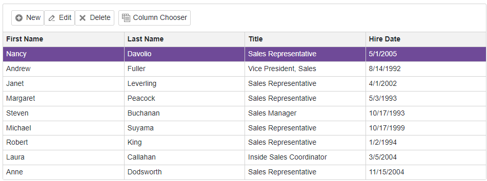

<!-- default badges list -->

<!-- default badges end -->
<!-- default file list -->

# Blazor Grid  - Implement CRUD-Related Buttons in Toolbar

This example demonstrates how to implement CRUD-related buttons for [Blazor Grid](https://docs.devexpress.com/Blazor/DevExpress.Blazor.DxGrid) in [Blazor Toolbar](https://docs.devexpress.com/Blazor/DevExpress.Blazor.DxToolbar).

The [ToolbarTemplate](https://docs.devexpress.com/Blazor/DevExpress.Blazor.DxGrid.ToolbarTemplate) allows you to add a toolbar at the top edge of a Grid component. This template contains all styles out of the box so that you do not need to write your own CSS rules. You can use the [Grid](http://docs.devexpress.com/Blazor/DevExpress.Blazor.GridToolbarTemplateContext.Grid) object in the template's context to access the component's instance and implement data shaping operations as Toolbar buttons.

## Files to Review

- [Index.razor](./CS/SampleBlazorApp/Pages/Index.razor)

## Documentation

- [DxGrid](https://docs.devexpress.com/Blazor/DevExpress.Blazor.DxGrid)
- [DxGrid.ToolbarTemplate](https://docs.devexpress.com/Blazor/DevExpress.Blazor.DxGrid.ToolbarTemplate)
- [DxToolbar](https://docs.devexpress.com/Blazor/DevExpress.Blazor.DxToolbar)

## More Examples

- [Blazor Grid - Display a Context Menu](https://github.com/DevExpress-Examples/blazor-dxgrid-show-context-menu)
